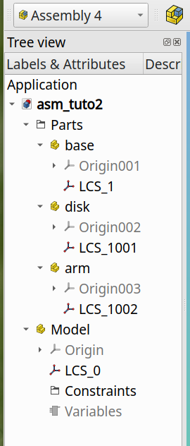
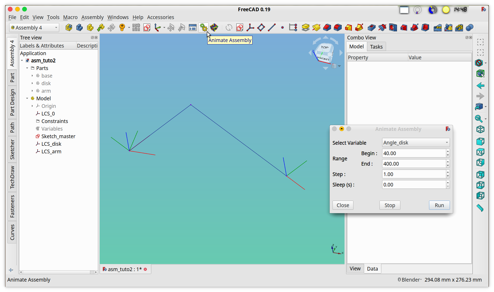
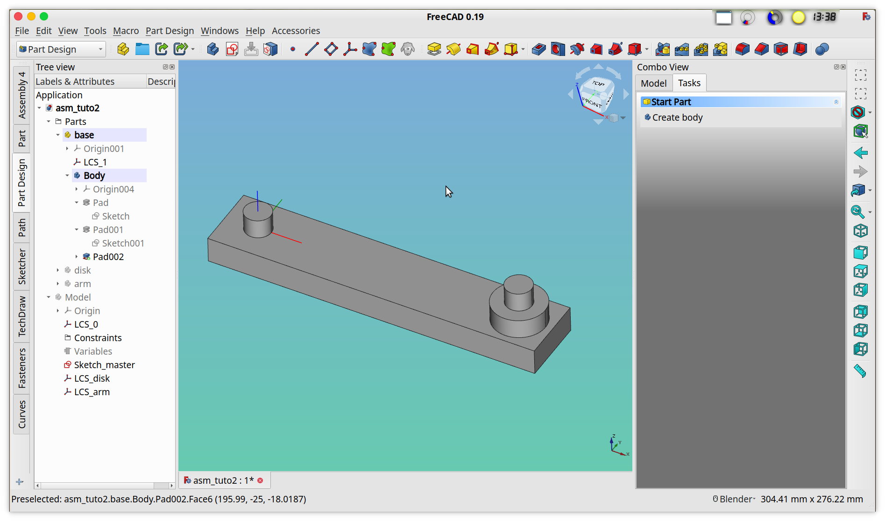
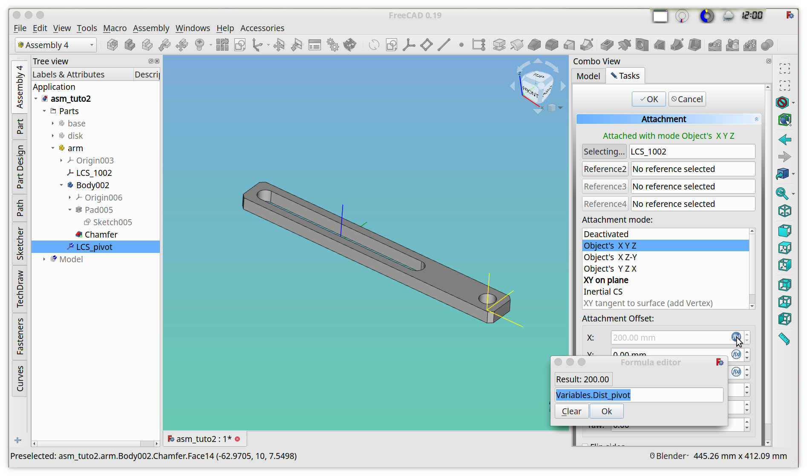
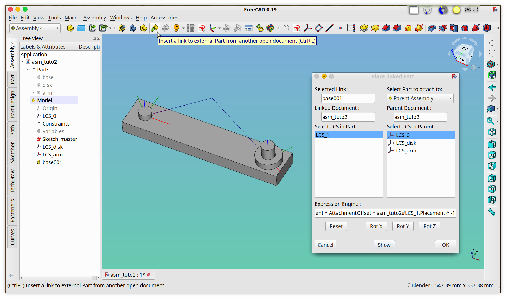

# FreeCAD Assembly 4

## 教程 2

在本教程中，我们将在单个 FreeCAD 文档中装配三个零件，并在主草图中建立运动动画：

* 底座被固定并包含两个轴
* 圆盘中心绕其中一轴装配
* 摇臂可绕底座的另一轴摆动
* 圆盘上设有一凸柄并卡入摇臂槽中
* 所有三个零件和装配体将保存到单个 FreeCAD 文件中

### 先决条件

假定您已完成 [Assembly4 第一部分教程](../Asm4_Tutorial1/README.md)，并且具有使用 FreeCAD 进行设计的经验，特别是使用 _PartDesign_ 和 _Sketcher_ 工作台的经验。

## 新建文档与零件：

我们从空白的 FreeCAD 文档开始：

* 新建文档：**文件 > 新建** (或者 _ctrl-n_)
* 在此文档中新建一个 Assembly4 Model：**Assembly > Create a new Model** (或者 _ctrl+m_)
* 再新建三个零件：**Assembly > Create a new Part**，并命名为
  * _base_ (_底座_)
  * _disk_ (_圆盘_)
  * _arm_ (_摇臂_)
* 请注意这三个零件位于 _Parts_ 组中
* 保存文档并命名为 _asm_tuto2.fcstd_ 

**成果：** 现在文档已经可用于 Assembly4 作业了。

## 主草图

我们首先创建装配体的功能结构，之后才设计组成装配体的零件。功能结构由草图和基准对象组成并包含在装配体的根目录处，它们的组成位置为实际功能位置，譬如旋转轴、平面、固定点、平移轴等等......

我们在此提出一种装配方法——一种基于 _功能_ 的装配方法而非基于 _几何体_ 的装配方法——这种装配方法基于各零件对于装配体的实际机械功能，而非其几何外形。有意思的是，_在本质上_，所有这些装配方法其实都是基于功能的装配方法，只是基于几何体的装配方法是在逆向计算出零件的几何特征对于装配体所实现的机械功能而已。换句话说，譬如，零件上有一个——_几何_ 特征意义上的——轴孔用于支撑轴，那是因为零件设计者知道这里将有一个——_功能_ 实现意义上的——旋转功能，而不是因为一些幸运的魔法。

这种基于功能的装配方法也被称作 _自顶而下的_ 设计方法，有别于装配已完成零件的 _自底而上的_ 设计方法。

乍一看，这种基于功能的装配方法——或者说自顶而下的设计方法——可能看起来不如大多数 CAD 软件所实现的基于几何体的装配方法那么直观，但是一旦你开始熟悉这种方法，它会显得更自然，而且表现得更强大：譬如说，你可以为旋转机构定义一个基准轴而无需了解如何实现旋转的具体机械细节，而且你还可以围绕这个基准轴来装配零件。因此，这就提供了一种将具体零件设计拆分给不同设计者进行并行设计的可能，并且还能保证设计出来的所有零件能够正确地组装到一起。

### 变量

我们将为我们的装配体新建一些变量。首先，创建一个变量来表示圆盘在底座上的旋转角度：

* 新建一个新变量： **Assembly > Add variable**
* 选择值的类型： _Float_ (表示为十进制浮点型)
* 命名为：Angle_disk
* 设置默认值为 30.00
* 单击 **OK**

用相同方法创建其他两个变量来代表圆盘半径 (_R_disk_ 取值 100.00) 和距枢轴距离 (_Dist_pivot_ 取值 300.00)。

**成果：** 我们已经在 _App::FeaturePython_ 对象中创建了一些数值变量，称为 _Variables_ (详见 Model 目录树)，它们可以表示为 _表达式求值引擎_ (_ExpressionEngine_) 中的任意参数，现在文档中包含的变量有：_Variables.Angle_disk_、_Variables.Dist_pivot_ 以及 _Variables.R_disk_。 

### 草图

现在我们将要给我们的装配体创建合适的主草图：

* 在 model 目录树中选中 _Model_
* 新建草图：**Assembly > New sketch**
* 命名为 _Sketch_master_ 
  * 这将启动草图的附属对话框
* 作为第一个参考，在 model 目录树中选择 _LCS_0_ (或者手动输入 _LCS_0_ 字段)
* 选择附属模式为 _Object's XY_
* 单击 **OK**

**成果：** 我们在 Assembly4 Model 中创建了一张空草图并平铺到 X-Y 平面上。现在我们可以在草图上绘图了：

* 在 _Sketch_master_ 项上右击并选择 **Edit sketch**
* 从原点开始绘制第一条直线
  * 这条线代表 _disk_ 的旋转方向
* 在直线和 X 轴之间创建角度约束
* 点击输入框边缘的 _f(x)_ 标记将会弹出表达式求值引擎编辑器
* 输入 _Variables.Angle_disk_ (会有自动补全提示)
* 单击 **OK**
 
**请注意：** 尺寸颜色已由红色改为橙色 (这取决于你的设置)

**成果：** 我们已将变量 _Angle_disk_ 绑定到这条线与 X 轴之间的夹角上。

* 同样的，绑定线长值为 _R_disk_
  * 线的端点表示滑动于 _摇臂_ 槽的凸柄在 _圆盘_ 上的位置
* 在线的端点与 X 轴之间添加另一条线
  * 这条线代表 _摇臂_ 的方向
* 将第二条线在 X 轴上的端点与 Y 轴之间的距离绑定为 _Dist_pivot_ 

**请注意：** 如果 FreeCAD 草图被完全约束，那么线条颜色将从白色变为绿色 (这取决于你的设置)。

* 关闭草图工作台

**成果：** 我们的主草图已完成。

**请注意：** 需重点注意的是，给一个装配体结构建立主草图会有很多种方法，所以建议你先花一些时间去建立一个对后续工作有利的草图，然后再去进行零件的详细形体设计。在我们的例子中，其运动学原理非常简单，所以我们的主草图设计也非常简单。通常来说，任何能简化为一个 2D 几何模型的问题都能用这种方法轻松建模。一些拥有 3D 空间结构的装配体也可以通过一系列的主草图建模，当然，还有一些可能会很难，譬如：六角架。

### 创建附属 _LCS_

现在我们将创建两个 LCS 来附属到运动的 _圆盘_ 和 _摇臂_。_底座_ 将被固定到已在装配体文件中存在的 _LCS_0_ 上。这些坐标系统 (类型为 _PartDesign::CoordinateSystem_) 将以 **Assembly4** 的方式附属装配零件为装配体。

**请注意：** 三个 (空的) 零件的默认坐标系统可以用这种方法轻松选取。因此，暂时隐藏所有三个零件将会非常有帮助。当隐藏时，对象在 Model 目录树中的图标将变灰。通常，不需要犹豫是否有必要显示或者隐藏零件：有时，让所有零件显示会更好，而有时，只看到单个对象会更好。

* 选中 Assembly4 Model 并创建一个新的坐标系统：**Assembly -> New Coordinate System**
* 命名为 _LCS_disk_
  * 这一步会激活附属对话框
* 选择 _Sketch_master_ 中的原点作为第一参考对象
* 选择 _Sketch_master_ 中的第一条线作为第二参考对象
* 选择 _Align O-X-Y_ 作为附属模式
* 单击 **OK**

**成果：** _LCS_disk_ 现在沿 _Sketch_master_ 中的第一条线绑定

我们现在对另一个坐标系统做相同的事，将其命名为 _LCS_arm_ 并附属到在主草图中代表摇臂的线上。

作为零件设计前的最后一次检查，你可以建立主草图动画来确认 LCS 是否确实按预期运动 (详见本教程下一节) 。你也可以改变变量 _Dist_pivot_ 和 _R_disk_ 的值来检查一切是否按照预期运行。最后保存。

**成果：** 我们现在创建了三个坐标系统，并将其放置到了三个零件应处的位置，且保证各自坐标变换朝向正确：

* _LCS_0_ 用于 _底座_
* _LCS_disk_ 用于 _圆盘_
* _LCS_arm_ 用于 _摇臂_

### 主草图动画

在进行更进一步操作之前，我们将通过动画来检查草图是否按照预期工作：

* 单击 **Animate Assembly** 按钮 (或在菜单寻找 **Assembly -> Animate Assembly**) 
* 选中变量 _Angle_disk_ 
* 选择 40 到 400 作为 _Begin_ 与 _End_ 变量
* 选择 1 作为 _Step_ 而 0 作为 _Sleep_
* 单击 **Run**

**成果：** 检查 _Sketch_master_ 中的直线是否按照预期带着 _LCS_ 移动。如果不是，检查哪里出现了问题并修复好它。

## 零件

现在我们开始设计用于装配的三个零件。为了避免混淆，建议隐藏除正在设计的零件之外的其他零件。

我们将使用 PartDesign 工作台进行几何形体设计。我们假定你已熟悉如何使用 FreeCAD 设计零件，这里不再详述过程方法。

### 底座部分

* 隐藏零件 _disk_ (_圆盘_) 、_arm_ (_摇臂_) 与装配体 _Model_
* 在 Model 目录树中选中 _base_ (_底座_)
* 在 Assembly4 工作台上创建新实体 (Body) (**请勿** 通过 _PartDesign_ 工作台创建！请通过 Assembly4 工作台在选中零件目录内创建实体。)
* 在新建的实体上右击并选择 **Toggle Active Body**
  * 这将跳转到 _PartDesign_ 工作台 (现在才可以使用)
* 创建下图几何体：
  * 两枢轴间距离绑定为变量 _Dist_pivot_

**成果：** 零件 _底座_ 完成

### 圆盘部分

* 选中零件 _disk_ (_圆盘_)
* 创建新实体并激活编辑
* 创建下图几何体：
  * 沿 X 轴绑定凸柄到原点距离为 _R_disk_

**成果：** 零件 _圆盘_ 完成

### 摇臂部分

* 选中零件 _arm_ (_摇臂_)
* 创建新实体并激活编辑
* 创建下图几何体：
  * 设置槽沿 X 轴长度为 _R_disk_ 的两倍
  * 将枢轴孔距原点距离与 _Dist_pivot_ 绑定

* 转到 Assembly4 工作台
* 选中零件 _arm_ (_摇臂_)
* 新建坐标系统，命名为 _LCS_pivot_
  * 这个 _LCS_pivot_ 必须放置到零件 _摇臂_ 的根目录 **而不是** 放置到 **Body** 的目录中
* 使用 _Object's X Y Z_ 模式将 _LCS_pivot_ 附属到零件 _摇臂_ 的源 LCS 上 (在我们的设计中被称作 _LCS_1002_，这可能在你的使用中不同)
  * 在表达式求值引擎的 _AttachmentOffset_ 面板中将 X 值绑定为 _Dist_pivot_
* 单击 **OK**

**成果：** 零件 _摇臂_ 完成

保存文档。

## 装配

现在我们完成了主草图的创建和所有零件的设计工作，可以着手装配了。

因为通常在 Assembly4 中，由装配孔 (_App::Link_) 链接零件 (_App::Part_)，而不是零件间互相装配——即使这些零件位于同一个文档中——所以，使用同一文档中的零件进行装配与使用外部文档中的零件进行装配处理方式完全相同。实际上，我们可以随意混用这两种方法。

唯一的不同是，因为每个 FreeCAD 文档只能包含一个 Assembly4 Model，所以如果所有部件都在同一个文档中的话只能包含一层装配。这对于大型装配体来说是一个严重的限制。因此，为了编辑嵌套式装配体——即装配体由子装配体装配成，而子装配体又由其子装配体装配成——就需要多个文档。[教程 1](TUTORIAL1.md) 中有如何用外部文档零件来实现装配的说明。

### 装配底座部分

* 隐藏零件 _base_ (_底座_)、_disk_ (_圆盘_)、_arm_ (_摇臂_) ，并显示装配体 _Model_
* 插入零件 _base_ (_底座_)
* 将其 _LCS_1_ 附属到 _LCS_0_ 上

**请注意：** 因为 FreeCAD 文档中所有对象都需要有不同的名称，所以我们对零件所插入的链接不能有与源零件相同的名称。FreeCAD 会自动重命名 _base_ 的链接为 _base_001_。这是也单文档装配体的另一个限制。

### 装配圆盘部分

* 为了便于观察，将变量 _Angle_disk_ 值设为 45
* 插入零件 _disk_ (_圆盘_)
* 将其 _LCS_1001_ 附属到 _LCS_disk_ 上

### 装配摇臂部分

* 插入零件 _arm_ (_摇臂_)
* 将其 _LCS_pivot_ 附属到 _LCS_arm_ 上
  * 你可能需要旋转 Z 与 _Rot Z_ 之间的夹角来正确定位摇臂

### 调整高度

现在我们已经将所有零件附属到各自的坐标系统当中，它们应当已经正确放置和定位。然而，如果你仔细观察会发现它们运动时将会发生碰撞，因为我们没有考虑装配高度。这必须要通过链接的 AttachmentOffset 面板调整属性：

* 选中实例 _arm001_
* 将 AttachmentOffset 面板中 Z 轴位置属性调整到 10

### 建立装配体动画

这是最后一步：建立装配体动画来检查所有零件是否按照预期运动：

* 单击 **Animate Assembly** 按钮 (或者菜单寻找 **Assembly -> Animate Assembly**)
* 选中变量 _Angle_disk_ 
* 选择 40 和 400 作为 _Begin_ 和 _End_ 的值
* 选择 4 作为 _Step_ 而 0 作为 _Sleep_
* 单击 **Run**

## 下载

你可以在此处下载本教程中所介绍的 FreeCAD 文档源文件：[asm_tuto2.FCStd](asm_tuto2.FCStd)

## 反馈

本教程对您有帮助吗？或者您有什么想要分享的吗？您可以到 [FreeCAD 论坛专用板块](https://forum.freecadweb.org/viewtopic.php?f=20&t=34806) 提交工单或讨论本教程。您也可以向我们提交您的建议改动。

祝装配愉快！

