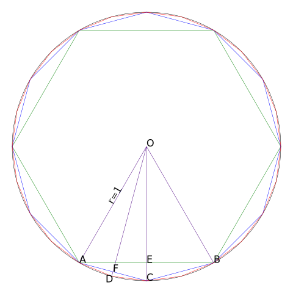

# [Java] 割圆术计算π
关于割圆术，我不想过多介绍，具体看百科:

[百度百科-割圆术](https://baike.baidu.com/item/%E5%89%B2%E5%9C%86%E6%9C%AF)

[Wiki百科-刘徽割圆术](https://zh.wikipedia.org/wiki/%E5%89%B2%E5%9C%86%E6%9C%AF_(%E5%88%98%E5%BE%BD))



如图所示，根据圆的面积公式S=πr<sp>2</sp>可知，当圆的半径为1时，圆的面积等于π，所以我们可以算半径为1的正多边形的面积，即可得到近似的π。观察图像，S<sub>圆</sub>&gt;S<sub>正24边形</sub>&gt;S<sub>正12边形</sub>&gt;S<sub>正6边形</sub>，所以我们的计算结果的精确度随边的个数的增加而提高，但始终小于S<sub>圆</sub>，即始终小于π

S<sub>正6边形</sub>=S<sub>ΔABO</sub>=1/2×OA×OB×sin60°×6=3√3/2<br/>
S<sub>ΔABO</sub>=S<sub>ΔAOE</sub>+S<sub>ΔBOE</sub><br/>
S<sub>四边形OACB</sub>ΔAOC+ΔBOC<br/>
∵OC垂直平分AB<br/>
∴SΔABO=2SΔAEO=2×(1/2×AE×OE)<br/>
 S四边形OACB=2SΔACO=2×(1/2×AE×OC)=2×(1/2×AE×OA)<br/>
∴SΔABO/S四边形OACB=2SΔAEO/2SΔACO=OE/OC=cos∠AOE<br/>
∴S四边形OACB=SΔABO/cos∠AOE<br/>
同理:S四边形ADCO=SΔACO/cos∠AOF<br/>
同理可得{Sn}的递推公式(Sn为正3×2∧n边形的面积):Sn+1=Sn/cos(60°/2∧n), S1=3√3/2<br/>
它的通项公式我算不出来，但好在我可以在代码里用循环算Sn<br/>
由于代码里算余弦函数就要用到弧度制角度，而这就离不开用到π，所以为了避免在计算π时用到π，我根据cos60°=1/2，cosα=√((1+cos2α)/2)，同样可以得到一个递推公式an+1=√((1+an)/2)(其中an=cos(60°/2∧n))<br/>
那么Sn=S1/a1/a2/a3/.../an=S1/(a1×a2×a3×...×an)

所以，代码上场:
```java
import java.util.Scanner;

public class Main {
	public static void main(String[] args){
		Scanner input=new Scanner(System.in);
		int n=input.nextInt(),i=1;
		double p=0.5/*cos60°*/,s=1;
		while(i<=n){//计算a1*a2*a3*...*an
			p=Math.sqrt((p+1)/2);
			s=s*p;
			i++;
		}
		System.out.println(1.5*Math.sqrt(3)/s);
	}
}
```
结果:
```
99
3.141592653589794
```
其实我输入90, 100得到的结果都一样，因为double的精度远远不够。为了解决这个问题，我使用了 `java.math.BigDecimal` 类来计算:
```java
import java.math.BigDecimal;
import java.math.MathContext;
import java.math.RoundingMode;
import java.util.Scanner;

public class Main {
	static MathContext mc = new MathContext(100, RoundingMode.HALF_UP); 		
	//BigDecimal开方
	public static BigDecimal sqrt(BigDecimal a) {
		BigDecimal _2=BigDecimal.valueOf(2.0);
		if(a.compareTo(BigDecimal.ZERO)==0)return BigDecimal.ZERO;
		else{
			BigDecimal x=a;
			int cnt=0;
			while(cnt<100){
				x=(x.add(a.divide(x,mc))).divide(_2,mc);
				cnt++;
			}
			return x;
		}
	}

	public static void main(String[] args){
		Scanner input=new Scanner(System.in);
		int n=input.nextInt(),i=1;
		BigDecimal p=new BigDecimal("0.5"),s=BigDecimal.ONE;
		while(i<=n){//计算a1*a2*a3*...*an
			p=sqrt(p.add(BigDecimal.ONE).divide(new BigDecimal("2"),mc));
			s=s.multiply(p);
			i++;
		}
		System.out.println(sqrt(new BigDecimal("3")).multiply(new BigDecimal("1.5")).divide(s,mc));
	}
}
```
BigDecimal开方算法来源:[牛顿迭代法求大数开方](http://kugwzk.info/index.php/archives/1662)<br/>
结果:
```
100
3.141592653589793238462643383279502884197169399375105820974944</span class="pl-err">234988309941294683211597479745467855302</span>
```
该结果小数点后至第60位都是正确的。
